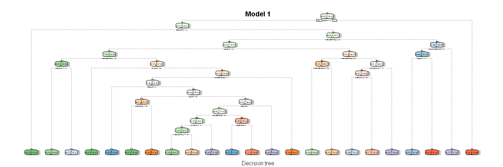
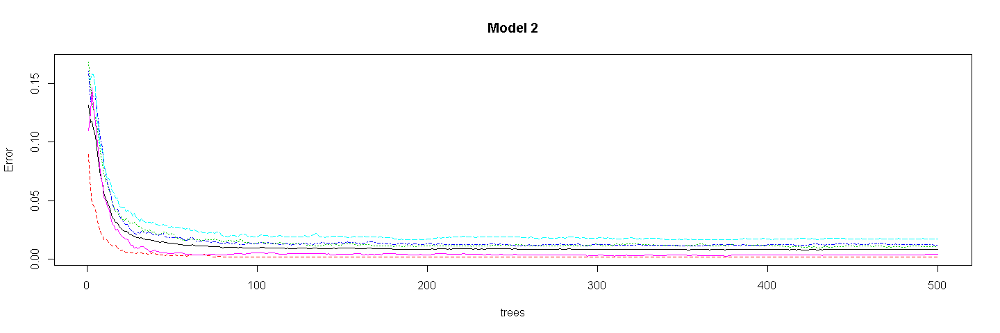
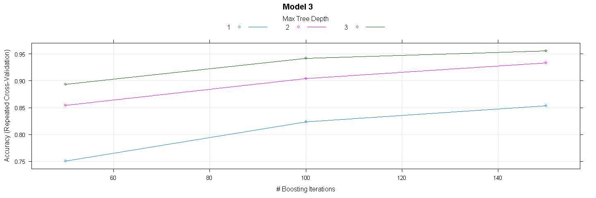

# Practical Machine Learning Course Project
M  
January 13, 2017  


## Introduction
This project is a part of the Practical Machine Learning Course by John Hopkins University on Coursera.

## Executive Summary
Using devices such as Jawbone Up, Nike FuelBand, and Fitbit it is now possible to collect a large amount of data about personal activity relatively inexpensively. These type of devices are part of the quantified self movement - a group of enthusiasts who take measurements about themselves regularly to improve their health, to find patterns in their behavior, or because they are tech geeks. One thing that people regularly do is quantify how much of a particular activity they do, but they rarely quantify how well they do it. In this project, the goal is to use data from accelerometers on the belt, forearm, arm, and dumbell of 6 participants. They were asked to perform barbell lifts correctly and incorrectly in 5 different ways. More information is available from the website here: http://groupware.les.inf.puc-rio.br/har.

## Analysis


```r
library(caret)
```

```
## Loading required package: lattice
```

```
## Loading required package: ggplot2
```

```r
library(rpart)
library(rpart.plot)
library(rattle)
```

```
## Rattle: A free graphical interface for data mining with R.
## Version 4.1.0 Copyright (c) 2006-2015 Togaware Pty Ltd.
## Type 'rattle()' to shake, rattle, and roll your data.
```

```r
library(randomForest)
```

```
## randomForest 4.6-12
```

```
## Type rfNews() to see new features/changes/bug fixes.
```

```
## 
## Attaching package: 'randomForest'
```

```
## The following object is masked from 'package:ggplot2':
## 
##     margin
```

```r
library(plyr)
library(survival)
```

```
## 
## Attaching package: 'survival'
```

```
## The following object is masked from 'package:caret':
## 
##     cluster
```

```r
library(splines)
library(parallel)
library(gbm)
```

```
## Loaded gbm 2.1.1
```

### Download and Clean the Data

```r
training <- read.csv("pml-training.csv", header=TRUE, na.strings=c("NA", "", "#DIV/0!"))
testing <- read.csv("pml-testing.csv", header=TRUE, na.strings=c("NA", "", "#DIV/0!"))
# Converting the values into numeric
for(i in c(8:ncol(training)-1)){
  training[,i]= as.numeric(as.character(training[,i]))
  testing[,i]= as.numeric(as.character(testing[,i]))
}
training[is.na(training)] <-0 # Assigning 0 to all NAs
training <- training[-c(1:7)] # Removing first 7 columns

testing[is.na(testing)] <- 0
testing <- testing[-c(1:7)]
# Partitioning the Data
inTrain <- createDataPartition(training$classe, p=0.6, list=FALSE)
myTraining <- training[inTrain,]
myTesting <- training[-inTrain,]
```

## Fitting Models
### Model 1: Decision Tree

```r
mod_DT <- rpart(classe ~., method="class", data=myTraining)
fancyRpartPlot(mod_DT, main="Model 1", sub="Decision tree")
```

<!-- -->

```r
pred_DT <- predict(mod_DT, myTesting, type="class")
confusionMatrix(pred_DT, myTesting$classe)
```

```
## Confusion Matrix and Statistics
## 
##           Reference
## Prediction    A    B    C    D    E
##          A 2015  240   45  106   50
##          B   63  880  118  103  137
##          C   50  218 1099  179  157
##          D   68  101   72  807   65
##          E   36   79   34   91 1033
## 
## Overall Statistics
##                                           
##                Accuracy : 0.7436          
##                  95% CI : (0.7337, 0.7532)
##     No Information Rate : 0.2845          
##     P-Value [Acc > NIR] : < 2.2e-16       
##                                           
##                   Kappa : 0.6746          
##  Mcnemar's Test P-Value : < 2.2e-16       
## 
## Statistics by Class:
## 
##                      Class: A Class: B Class: C Class: D Class: E
## Sensitivity            0.9028   0.5797   0.8034   0.6275   0.7164
## Specificity            0.9214   0.9335   0.9068   0.9534   0.9625
## Pos Pred Value         0.8204   0.6764   0.6453   0.7251   0.8115
## Neg Pred Value         0.9597   0.9025   0.9562   0.9289   0.9378
## Prevalence             0.2845   0.1935   0.1744   0.1639   0.1838
## Detection Rate         0.2568   0.1122   0.1401   0.1029   0.1317
## Detection Prevalence   0.3130   0.1658   0.2171   0.1419   0.1622
## Balanced Accuracy      0.9121   0.7566   0.8551   0.7904   0.8394
```

### Model 2: Random Forest

```r
mod_RF <- randomForest(classe ~ ., myTraining)
plot(mod_RF, main="Model 2")
```

<!-- -->

```r
pred_RF <- predict(mod_RF, myTesting, type="class")
confusionMatrix(pred_RF, myTesting$classe)
```

```
## Confusion Matrix and Statistics
## 
##           Reference
## Prediction    A    B    C    D    E
##          A 2231   13    0    0    0
##          B    1 1505   18    0    0
##          C    0    0 1348   20    1
##          D    0    0    2 1266    1
##          E    0    0    0    0 1440
## 
## Overall Statistics
##                                           
##                Accuracy : 0.9929          
##                  95% CI : (0.9907, 0.9946)
##     No Information Rate : 0.2845          
##     P-Value [Acc > NIR] : < 2.2e-16       
##                                           
##                   Kappa : 0.991           
##  Mcnemar's Test P-Value : NA              
## 
## Statistics by Class:
## 
##                      Class: A Class: B Class: C Class: D Class: E
## Sensitivity            0.9996   0.9914   0.9854   0.9844   0.9986
## Specificity            0.9977   0.9970   0.9968   0.9995   1.0000
## Pos Pred Value         0.9942   0.9875   0.9847   0.9976   1.0000
## Neg Pred Value         0.9998   0.9979   0.9969   0.9970   0.9997
## Prevalence             0.2845   0.1935   0.1744   0.1639   0.1838
## Detection Rate         0.2843   0.1918   0.1718   0.1614   0.1835
## Detection Prevalence   0.2860   0.1942   0.1745   0.1617   0.1835
## Balanced Accuracy      0.9986   0.9942   0.9911   0.9920   0.9993
```

### Model 3: Generalized Boosted Regression

```r
set.seed(543)
fitControl <- trainControl(method = "repeatedcv",
                           number = 3,
                           repeats = 1)
mod_BR <- train(classe ~., myTraining, method="gbm", trControl=fitControl, verbose = FALSE)
plot(mod_BR, main="Model 3")
```

<!-- -->

```r
mod_BR_final <- mod_BR$finalModel
pred_BR <- predict(mod_BR, myTesting)
confusionMatrix(pred_BR, myTesting$classe)
```

```
## Confusion Matrix and Statistics
## 
##           Reference
## Prediction    A    B    C    D    E
##          A 2199   48    0    2    4
##          B   18 1429   46    6   13
##          C    9   38 1309   54   12
##          D    2    2   12 1212   18
##          E    4    1    1   12 1395
## 
## Overall Statistics
##                                          
##                Accuracy : 0.9615         
##                  95% CI : (0.957, 0.9657)
##     No Information Rate : 0.2845         
##     P-Value [Acc > NIR] : < 2.2e-16      
##                                          
##                   Kappa : 0.9513         
##  Mcnemar's Test P-Value : 1.207e-11      
## 
## Statistics by Class:
## 
##                      Class: A Class: B Class: C Class: D Class: E
## Sensitivity            0.9852   0.9414   0.9569   0.9425   0.9674
## Specificity            0.9904   0.9869   0.9826   0.9948   0.9972
## Pos Pred Value         0.9760   0.9451   0.9205   0.9727   0.9873
## Neg Pred Value         0.9941   0.9859   0.9908   0.9888   0.9927
## Prevalence             0.2845   0.1935   0.1744   0.1639   0.1838
## Detection Rate         0.2803   0.1821   0.1668   0.1545   0.1778
## Detection Prevalence   0.2872   0.1927   0.1812   0.1588   0.1801
## Balanced Accuracy      0.9878   0.9641   0.9697   0.9686   0.9823
```

From the models, we can see that the Model 2 with Random Forest, has higher accuracy of 99%. Therefore, we will select Model 2 and apply the prediction on the "testing" data set.

```r
final_mod <- predict(mod_RF, testing)
final_mod
```

```
##  1  2  3  4  5  6  7  8  9 10 11 12 13 14 15 16 17 18 19 20 
##  B  A  B  A  A  E  D  B  A  A  B  C  B  A  E  E  A  B  B  B 
## Levels: A B C D E
```
