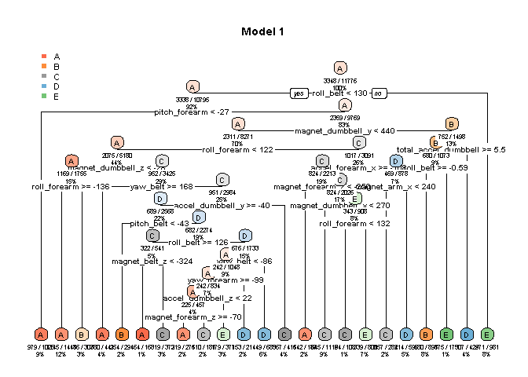
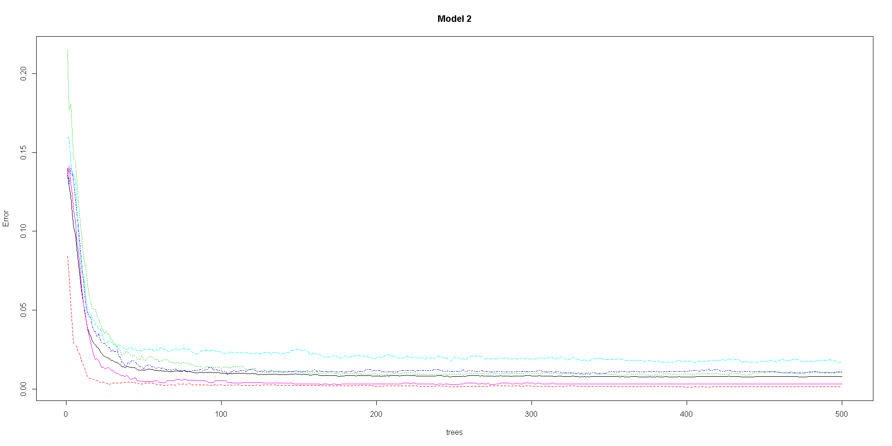

# Practical Machine Learning Course Project
M  
January 13, 2017  


## Introduction
This project is a part of the Practical Machine Learning Course by John Hopkins University on Coursera.

## Executive Summary
Using devices such as Jawbone Up, Nike FuelBand, and Fitbit it is now possible to collect a large amount of data about personal activity relatively inexpensively. These type of devices are part of the quantified self movement - a group of enthusiasts who take measurements about themselves regularly to improve their health, to find patterns in their behavior, or because they are tech geeks. One thing that people regularly do is quantify how much of a particular activity they do, but they rarely quantify how well they do it. In this project, the goal is to use data from accelerometers on the belt, forearm, arm, and dumbell of 6 participants. They were asked to perform barbell lifts correctly and incorrectly in 5 different ways. More information is available from the website here: http://groupware.les.inf.puc-rio.br/har.

## Analysis


```r
library(caret)
```

```
Loading required package: lattice
```

```
Loading required package: ggplot2
```

```r
library(rpart)
library(rpart.plot)
library(rattle)
```

```
Rattle: A free graphical interface for data mining with R.
Version 4.1.0 Copyright (c) 2006-2015 Togaware Pty Ltd.
Type 'rattle()' to shake, rattle, and roll your data.
```

```r
library(randomForest)
```

```
randomForest 4.6-12
```

```
Type rfNews() to see new features/changes/bug fixes.
```

```

Attaching package: 'randomForest'
```

```
The following object is masked from 'package:ggplot2':

    margin
```

```r
library(plyr)
library(survival)
```

```

Attaching package: 'survival'
```

```
The following object is masked from 'package:caret':

    cluster
```

```r
library(splines)
library(parallel)
library(gbm)
```

```
Loaded gbm 2.1.1
```

### Download and Clean the Data

```r
training <- read.csv("pml-training.csv", header=TRUE, na.strings=c("NA", "", "#DIV/0!"))
testing <- read.csv("pml-testing.csv", header=TRUE, na.strings=c("NA", "", "#DIV/0!"))
# Converting the values into numeric
for(i in c(8:ncol(training)-1)){
  training[,i]= as.numeric(as.character(training[,i]))
  testing[,i]= as.numeric(as.character(testing[,i]))
}
training[is.na(training)] <-0 # Assigning 0 to all NAs
training <- training[-c(1:7)] # Removing first 7 columns

testing[is.na(testing)] <- 0
testing <- testing[-c(1:7)]
```

## Cross-Validation
Cross-validation will be performed by splitting the training data set into 'myTraining' data (60%) and 'myTesting' data (40%).


```r
inTrain <- createDataPartition(training$classe, p=0.6, list=FALSE)
myTraining <- training[inTrain,]
myTesting <- training[-inTrain,]
```
## Out of Sample Error
The out of sample error is the value calculated by 1-accuracy in the cross-validation data. For a model to be a best fit, it is important to minimize the out of sample error. The out of sample error will be calculated later (see below) after we select a model with highest accuracy.

## Fitting Prediction Models
### Model 1: Decision Tree

Since our data set deals with multiple variables, I'm choosing Decision Tree as one of the Prediction Models.  The multiple variable analysis capability of decision trees enables you to go beyond simple one-cause, one-effect relationships and helps you to discover things in the context of multiple factors (influences); and almost all critical
outcomes are based on multiple factors.


```r
mod_DT <- rpart(classe ~., method="class", data=myTraining)
rpart.plot(mod_DT, cex = 0.6, main="Model 1", extra=102, under=TRUE)
```

<!-- -->

```r
pred_DT <- predict(mod_DT, myTesting, type="class")
confusionMatrix(pred_DT, myTesting$classe)
```

```
Confusion Matrix and Statistics

          Reference
Prediction    A    B    C    D    E
         A 1994  282   15   49   16
         B   63  690   58   66   71
         C   61  220 1142  134  129
         D   84   92   97  890  111
         E   30  234   56  147 1115

Overall Statistics
                                          
               Accuracy : 0.7432          
                 95% CI : (0.7334, 0.7528)
    No Information Rate : 0.2845          
    P-Value [Acc > NIR] : < 2.2e-16       
                                          
                  Kappa : 0.6749          
 Mcnemar's Test P-Value : < 2.2e-16       

Statistics by Class:

                     Class: A Class: B Class: C Class: D Class: E
Sensitivity            0.8934  0.45455   0.8348   0.6921   0.7732
Specificity            0.9355  0.95923   0.9160   0.9415   0.9271
Pos Pred Value         0.8463  0.72785   0.6773   0.6986   0.7048
Neg Pred Value         0.9566  0.87997   0.9633   0.9397   0.9478
Prevalence             0.2845  0.19347   0.1744   0.1639   0.1838
Detection Rate         0.2541  0.08794   0.1456   0.1134   0.1421
Detection Prevalence   0.3003  0.12083   0.2149   0.1624   0.2016
Balanced Accuracy      0.9144  0.70689   0.8754   0.8168   0.8502
```

### Model 2: Random Forest

Second model is Random Forest, and this Prediction Model is selected because Random forests generalize well to new data. It is unexcelled in accuracy among current algorithms. Iit runs efficiently on large data bases and can handle thousands of input variables without variable
deletion.


```r
mod_RF <- randomForest(classe ~ ., myTraining)
plot(mod_RF, main="Model 2")
```

<!-- -->

```r
pred_RF <- predict(mod_RF, myTesting, type="class")
confusionMatrix(pred_RF, myTesting$classe)
```

```
Confusion Matrix and Statistics

          Reference
Prediction    A    B    C    D    E
         A 2227   12    0    0    0
         B    3 1502   15    0    0
         C    2    4 1350   22    0
         D    0    0    3 1263    6
         E    0    0    0    1 1436

Overall Statistics
                                         
               Accuracy : 0.9913         
                 95% CI : (0.989, 0.9933)
    No Information Rate : 0.2845         
    P-Value [Acc > NIR] : < 2.2e-16      
                                         
                  Kappa : 0.989          
 Mcnemar's Test P-Value : NA             

Statistics by Class:

                     Class: A Class: B Class: C Class: D Class: E
Sensitivity            0.9978   0.9895   0.9868   0.9821   0.9958
Specificity            0.9979   0.9972   0.9957   0.9986   0.9998
Pos Pred Value         0.9946   0.9882   0.9797   0.9929   0.9993
Neg Pred Value         0.9991   0.9975   0.9972   0.9965   0.9991
Prevalence             0.2845   0.1935   0.1744   0.1639   0.1838
Detection Rate         0.2838   0.1914   0.1721   0.1610   0.1830
Detection Prevalence   0.2854   0.1937   0.1756   0.1621   0.1832
Balanced Accuracy      0.9978   0.9933   0.9913   0.9904   0.9978
```

## Conclusion

From the models, we can see that the Model 2 with Random Forest, has higher accuracy of 99.3%. Therefore, we will select Model 2 and apply the prediction on the "testing" data set.

## Estimating Out-of-Sample Error

Out of sample error is calculated as *1-accuracy* of the model tested on the sub-testing data - in our case it is 'myTesting' data. Since Model 2 has the highest accuracy of 99.3%, our out-of-sample error is calculated at 0.007 0r 0.7%.

## Submission of the Model

We finally use the testing data and use our Model 2 for prediction.

```r
final_mod <- predict(mod_RF, testing)
final_mod
```

```
 1  2  3  4  5  6  7  8  9 10 11 12 13 14 15 16 17 18 19 20 
 B  A  B  A  A  E  D  B  A  A  B  C  B  A  E  E  A  B  B  B 
Levels: A B C D E
```
